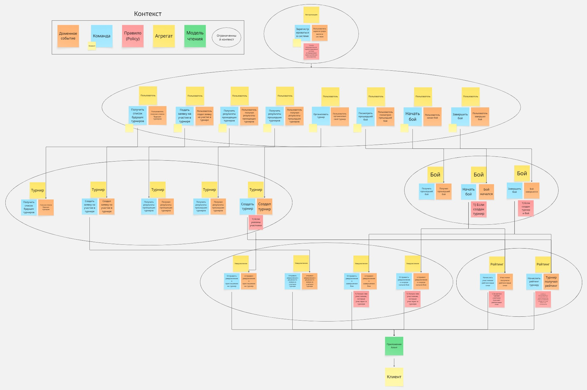
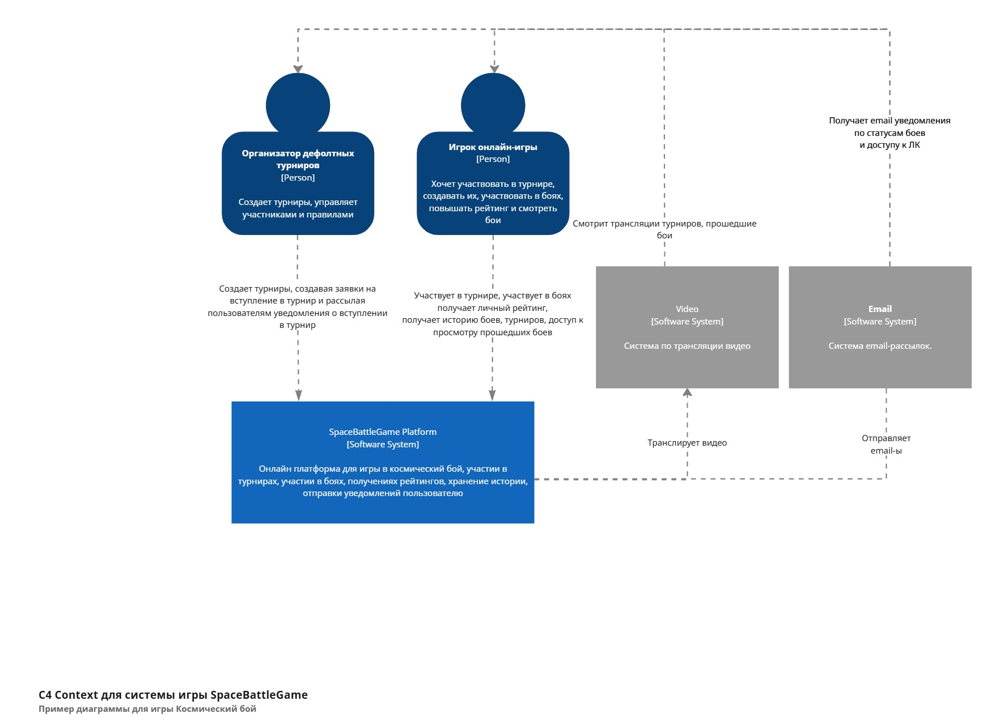
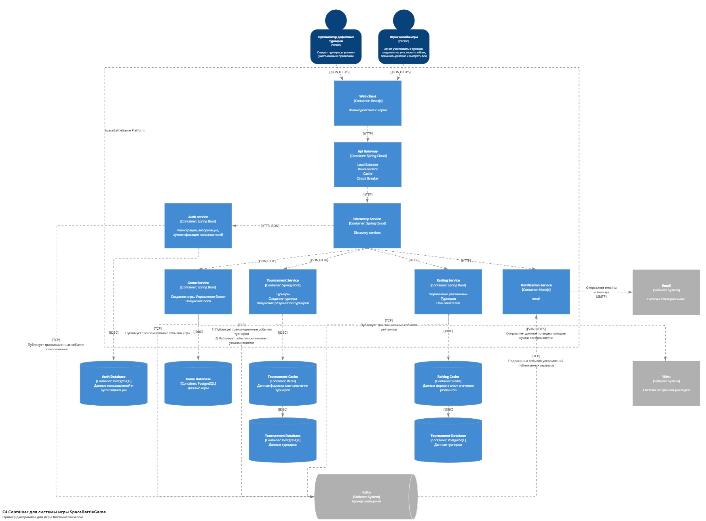
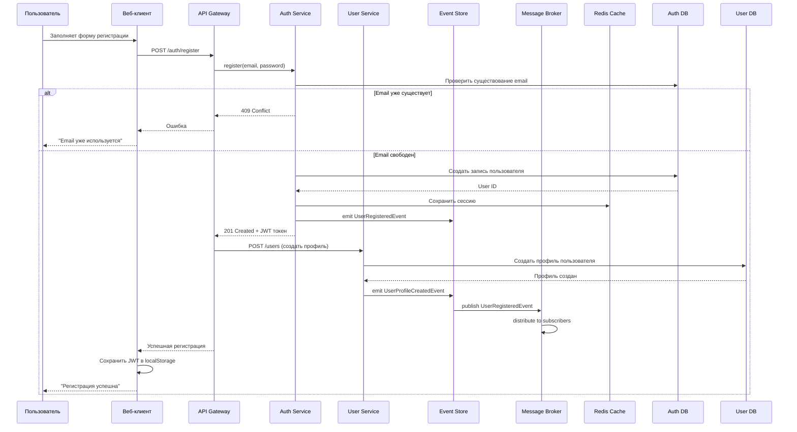
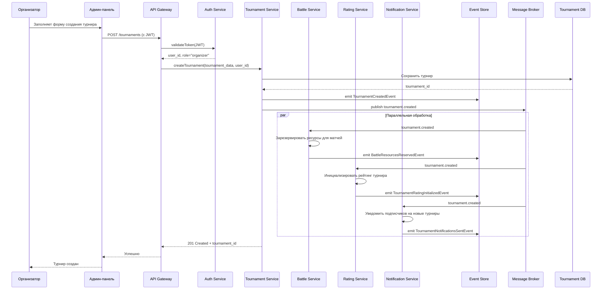

# space-battle-game-system
Тема: «Разработка устойчивого к изменениям игрового движка космический бой в микросервисной архитектуре»

## Адреса
* swagger auth-service: http://localhost:8092/swagger-ui/index.html
* postgres db auth: jdbc:postgresql://person-postgres:5432/person
* swagger game-service: http://localhost:8093/swagger-ui/index.html
* postgres db game: jdbc:postgresql://person-postgres:5433/game
* discovery-service ui: http://localhost:8761
* grafana: http://localhost:3000
* prometheus: http://localhost:9090

## Event Storming

## C4 model
C4 включает четыре уровня представления:

1. Context: высокоуровневый взгляд на систему. Показывает приложения и пользователей, без технических деталей.

2. Container: углубляет представление системы, описывая основные части, или "контейнеры" (backend-приложение, веб-приложение, мобильного приложение, базы данных, файловая система), которые входят в состав системы. На этом уровне определены функции каждого контейнера, технологические решения по языкам программирования, протоколы взаимодействия.

3. Component: детализирует каждый контейнер, описывая его компоненты и их взаимодействие.

4. Code: наиболее детальный уровень, описывающий внутреннюю структуру каждого компонента. Часто используются UML-диаграммы для его описания. Не обязателен.

### Context

### Container

## Endpoints и взаимодействие микросервисов
### 1. Auth Service (v1/auth/*)
Swagger: http://localhost:8092/swagger-ui/index.html
* POST /v1/auth/register - регистрация пользователя
* POST /v1/auth/refresh - обновление токена
* POST /v1/auth/logout - выход из системы
* POST /v1/auth/authorize - авторизация
* POST /v1/auth/organaizeSpacebattle - организовать бой
### 2. Game Service (v1/games/*)
Swagger: http://localhost:8093/swagger-ui/index.html
* GET /v1/game/order - запрос приказа на действие с игровым объектом
### 3. Tournament Service (/tournaments/*)
* POST /tournaments - создание турнира
* GET /tournaments - список турниров
* GET /tournaments/{id} - детали турнира
* POST /tournaments/{id}/register - регистрация в турнир
* PUT /tournaments/{id}/status - изменение статуса турнира
### 4. Rating Service (/ratings/*)
* GET /ratings/user/{id} - рейтинг пользователя
* GET /ratings/tournament/{id} - рейтинг турнира
* POST /ratings/calculate - пересчет рейтинга
* POST /ratings/create - создание рейтинга
* PUT /ratings/{id}/update - обновление рейтинга
### 5. Notification Service (/notifications/*)
* GET /notifications/ws - WebSocket для уведомлений
* POST /notifications - отправка уведомления
* GET /notifications/user/{id} - уведомления пользователя
### 6. Battle Engine (внутренний API)
* POST /engine/battle/start - запуск боя
* GET /engine/battle/{id}/status - статус выполнения
* POST /engine/validate - валидация программы агента
## Sequence Diagrams (Частично)
### 1. Полный цикл регистрации и аутентификации

### 2. Создание турнира организатором

## Узкие места и проблемы масштабирования
### 1. Проблема: Кастомная безопасность аутентификации и авторизации
**Описание:** Микросервисная архитектура повышает важность вопросов безопасности, поскольку запросы проходят через разные сервисы и могут подвергнуться атакам.
Возможность компрометации токенов и несанкционированного доступа к данным.

**Решение:**
* Реализация централизованной инфраструктуры аутентификации и авторизации на основе OAuth2 с использованием серверов идентификации, таких как Keycloak.

### 2. Проблемы мониторинга и трассировки запросов
**Описание:** Сложность заключается в отслеживании транзакций, проходящих через несколько микросервисов, особенно в распределённых системах.

**Решение:**
* Использовать инструменты вроде Zipkin, Jaeger, Grafana, Prometheus или встроенные средства Spring Cloud Sleuth. Эти инструменты позволяют собирать метрики и следить за потоком запросов через всю систему.

### 3. Масштабирование отдельных сервисов
**Описание:** Если нагрузка распределяется неравномерно среди сервисов, важно обеспечить динамическое масштабирование наиболее нагруженных узлов.

**Решение:**
* Реализовать автоматическое горизонтальное масштабирование сервисов с помощью Kubernetes или другого оркестратора контейнеров. Для балансировки нагрузки используйте Nginx или HAProxy перед нашими сервисами.

### 4. Обработка ошибок и обработка сбоев
**Описание:** Синхронные коммуникации между сервисами приводят к дополнительным рискам сбоев.

**Решение:**
* Применять паттерны Circuit Breaker и Retry Mechanism. Сервис Resilience4j предоставляет удобную реализацию этих механизмов для Java-приложений.

### 5. Согласованность данных между микросервисами
**Описание:** Сервисы имеют разные бд, распределенные транзакции теряют атомарность. 
**Решение:**
* Event Sourcing + Saga Pattern + outbox
* В сервисах добавить компенсирующие транзакции

### 6. Развертывание и оркестровка
**Описание:** Развёртывание большого количества микросервисов вручную требует значительных усилий и увеличивает вероятность человеческих ошибок.
**Решение:**
* Автоматизация развёртывания через CI/CD конвейеры с GitLab CI, Jenkins или GitHub Actions позволит значительно снизить рутинные операции и повысить стабильность.

### 7. API Gateway
**Описание:**
* Единая точка отказа – при падении gateway теряется доступ ко всем сервисам.
* Узкое место по производительности – через gateway проходят все запросы, что может вызвать задержки и ограничить пропускную способность.
* Неправильная маршрутизация – если discovery service недоступен или обновляется с задержкой, gateway может направлять запросы на несуществующие инстансы.
* Безопасность – концентрация аутентификации и авторизации требует высокой надёжности. 

**Решение:**
* Горизонтальное масштабирование – запуск нескольких экземпляров gateway за балансировщиком нагрузки (например, Nginx или облачный LB).
* Кэширование ответов – для часто запрашиваемых данных (например, публичные ключи, конфигурации).
* Rate limiting – для защиты от DDoS и перегрузок (можно реализовать на уровне gateway).
* Circuit breaker и retries – использование Resilience4J для устойчивости при сбоях downstream-сервисов.
* Резервирование discovery – настройка нескольких экземпляров Eureka и кэширование списка сервисов на стороне gateway.

## 8 Discovery Service (Eureka)
**Описание:**
* Эвентуальная согласованность – реестр не гарантирует мгновенную актуальность информации; клиенты могут обращаться к уже упавшим сервисам.
* Self-preservation mode – при сетевых проблемах Eureka может перестать удалять мёртвые инстансы, что приведёт к маршрутизации на недоступные узлы.
* Единая точка отказа – если discovery service падает, новые сервисы не могут зарегистрироваться, а существующие не обновляют статус.

**Решение:**
* Кластеризация Eureka – запуск нескольких peer-узлов для отказоустойчивости.
* Тонкая настройка таймаутов и heartbeats – сокращение времени обнаружения сбоев.
* Использование клиентского кэширования – в load balancer (Ribbon, Spring Cloud LoadBalancer) кэшируется список сервисов с возможностью fallback при недоступности Eureka.
* Рассмотреть переход на Kubernetes – встроенный service discovery (kube-dns / CoreDNS) и liveness probes более надёжны для production.

## 9. Управление конфигурацией
**Описание:**
* Разбросанные параметры – в каждом сервисе свои application.yml, сложно менять для разных сред.
* Секреты в коде – риск утечки.

**Решение:**
* Spring Cloud Config Server – централизованное хранение конфигураций с поддержкой Git.
* Профили Spring – для разделения dev/stage/prod.
* Vault – для хранения секретов с динамическим доступом.

### Ключевые архитектурные решения:
* API Gateway служит единой точкой входа, обеспечивая аутентификацию, лимиты запросов и маршрутизацию.
* Message Broker позволяет асинхронное взаимодействие между сервисами, уменьшая связность, транзакции.
* Разделение баз данных - каждый сервис управляет своей схемой данных.
* * Разделение кешей - некоторые сервисы используют кеш.
### Преимущества подхода:
* Масштабируемость: Каждый сервис можно масштабировать независимо.
* Устойчивость к отказам: Падение одного сервиса не приводит к остановке всей системы.
* Гибкость разработки: Команды могут работать над разными сервисами независимо.
* Технологическая гетерогенность: Возможность использовать разные языки/технологии для разных сервисов.
### Недостатки и компромиссы:
* Сложность развертывания: Требуется orchestration (Kubernetes).
* Сложность входа
* Сетевая задержка: Межсервисные вызовы добавляют latency.
* Сложность отладки: Требуется распределенная трассировка.
### Рекомендации по внедрению:
* Использовать feature flags для постепенного развертывания изменений.
* Внедрить comprehensive мониторинг с самого начала.
* Использовать contract testing для обеспечения совместимости API.
* Данная архитектура обеспечивает баланс между гибкостью, производительностью и сложностью поддержки, позволяя системе эволюционировать вместе с требованиями к игре.
